<div align="center">

<br/>

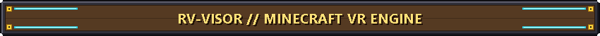

<br/><br/>

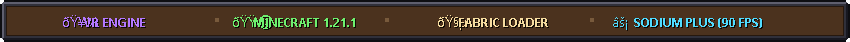

<br/><br/>

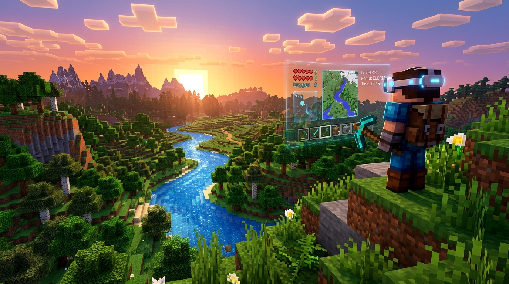

<br/><br/>

[](https://www.minecraft.net/)
[](https://fabricmc.net/)
[](https://modrinth.com/)
[](https://store.steampowered.com/app/250820/SteamVR/)
[](https://adoptium.net/)

---

<br/>

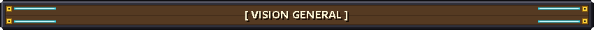

</div>

<br/>

**RV-Visor** es un mod de realidad virtual de alto rendimiento diseñado exclusivamente para **Minecraft 1.21.1 (Fabric)**. Permite jugar en VR con seguimiento posicional 6-DoF nativo, menús anclados espacialmente en 3D con puntero láser interactivo y sincronización completa con **Sodium Plus** para mantener **90 - 120 FPS estables**.

---

<div align="center">

<br/>

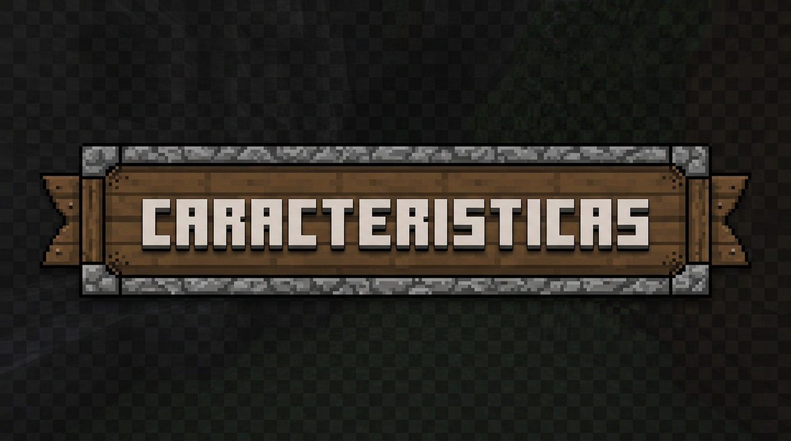

<br/><br/>

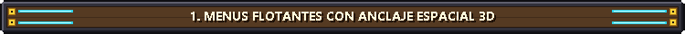

<br/><br/>

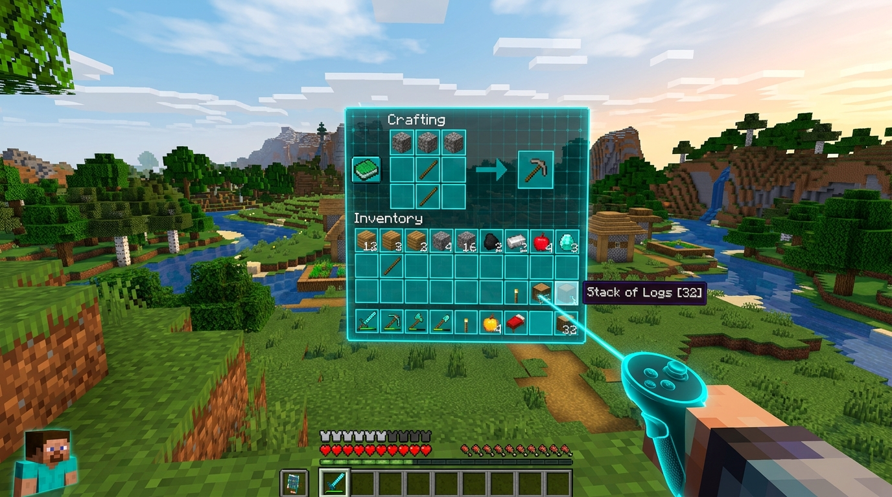

<br/><br/>

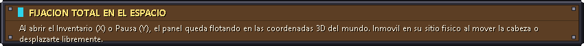

<br/><br/>

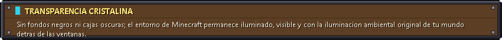

<br/><br/>

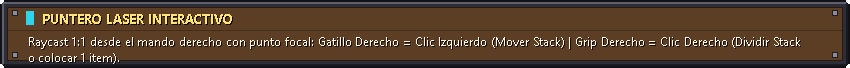

<br/><br/>

---

<br/>

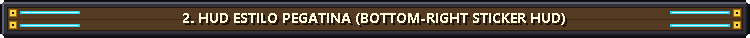

<br/><br/>

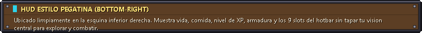

<br/><br/>

---

<br/>

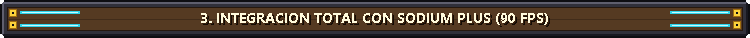

<br/><br/>

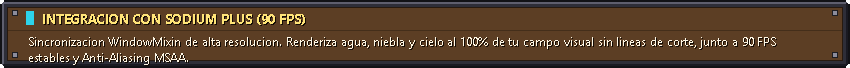

<br/><br/>

---

<br/>

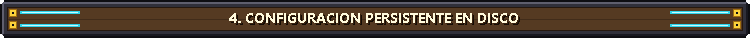

<br/><br/>

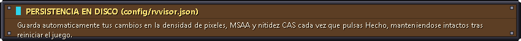

<br/><br/>

---

<br/>

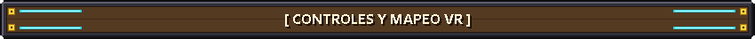

<br/><br/>

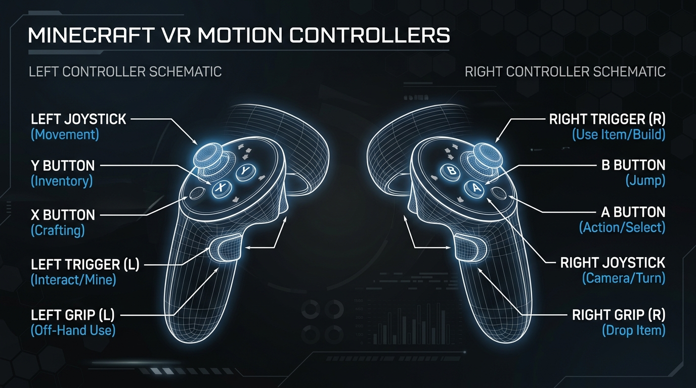

</div>

<br/>

| Botón / Control | Acción en Juego | Acción en Menú / Inventario |
| :--- | :--- | :--- |
| **Joystick Izquierdo** | Moverse / Caminar | *Bloqueado (Personaje Fijo)* |
| **Joystick Derecho** | Giro de Cámara Suave (Smooth Turn) | *Bloqueado (Personaje Fijo)* |
| **Gatillo Derecho (Right Trigger)** | Golpear / Romper Bloque / Atacar | Clic Izquierdo (Seleccionar / Mover Stack) |
| **Grip Derecho (Right Grip)** | Usar Ítem / Colocar Bloque | Clic Derecho (Dividir Stack / Colocar 1) |
| **Botón X (Mando Izquierdo)** | Abrir Inventario | **Cerrar Inventario al Instante** |
| **Botón Y (Mando Izquierdo)** | Menú de Pausa / Escape | **Cerrar Menú de Pausa** |
| **Botón A (Mando Derecho)** | Saltar (Jump) | - |
| **Botón B (Mando Derecho)** | Agacharse (Sneak) | - |
| **Left Grip + Stick Derecho** | Ciclar Rápido entre Ítems del Hotbar | - |

---

<div align="center">

<br/>

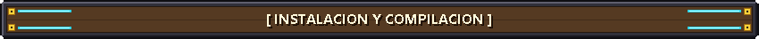

<br/><br/>

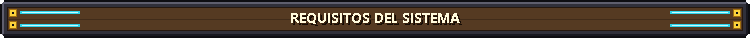

<br/>

</div>

* **Java JDK 21** (o superior)
* **Minecraft 1.21.1** con **Fabric Loader 0.16+**
* **Sodium** / **Sodium Plus**
* **SteamVR** con tu visor conectado (Meta Quest 2/3/Pro, Valve Index, HTC Vive, Pico 4, WMR).

### Compilación:
```bash
git clone git@github.com:Hyloozsgamer/RV-visor-Minecraft-Proyect.git
cd RV-visor-Minecraft-Proyect
./gradlew build -x test --no-daemon
```

El archivo compilado se genera en `build/libs/rvvisor-1.0.0.jar`. Cópialo a tu carpeta de mods o en tu perfil de Modrinth.

---

<div align="center">

**RV-VISOR // VIRTUAL REALITY FOR MINECRAFT**  
*Desarrollado para la comunidad de Minecraft VR.*

</div>
